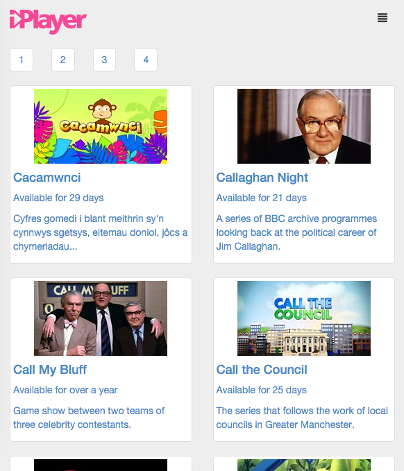

### iPlayer API challenge



### Setting up the project
This project requires an up to date version of Node.js  

first you wil need to clone it down from git and cd into the repo  
```
git clone https://github.com/NULL-OPERATOR/bbc_test.git && cd bbc_test
```
then run npm install to download all dependencies
```
npm install
```

### Running the server
```
npm start
```
this will invoke http-server, so you can visit the site in a browser at:
```
http://localhost:8000/app/
```


### Running tests  

##### Unit  
this will run tests and watch for updates, to cancel hit ctr+c (mac)
```
npm test
```

##### e2e  
*start the server in one terminal tab/window, then run the tests in another
```
tab1:  npm start
tab2:  npm run protractor
```
